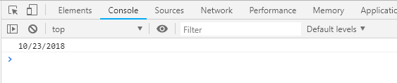

# Run the same app in node and in browser

## In this app we userd the following built-in options:
* `console.log`
* `Date`   
Both are in `window` and in `GLOBAL`


## Browser version:
```html
<!DOCTYPE html>
<html lang="en">
<head>
  <script>
      var d=new Date();
      console.log(d.toLocaleDateString())
    </script>
</head>
<body>
    
</body>
</html>
``` 
result:   



## Node version:
```javascript
var d=new Date();
console.log(d.toLocaleDateString())
```
result:  


