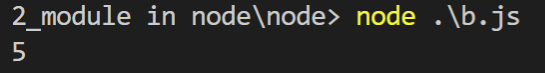

# Browser version
we run in the browsert the html page, so we include both scripts in the html header:
## a.js file
```javascript
function add(num1,num2){
    return num1+num2;
}
```
## b.js file
```javascript
console.log(add(2,3))
```
## index.html file
```html
<!DOCTYPE html>
<html lang="en">
<head>
  <script src="a.js"></script>
  <script src="b.js"></script>
</head>
<body>
    
</body>
</html>
```

# Node version
we run `node b.js` in the cli:
## a.js file
```javascript
function add(num1,num2){
    return num1+num2;
}


//define the json object that we export from this file
module.exports={
    "addFunc":add
}
```
## b.js file
```javascript
//now a contains the json object that a.js exported
var a=require("./a");

console.log(a.addFunc(2,3));

```
